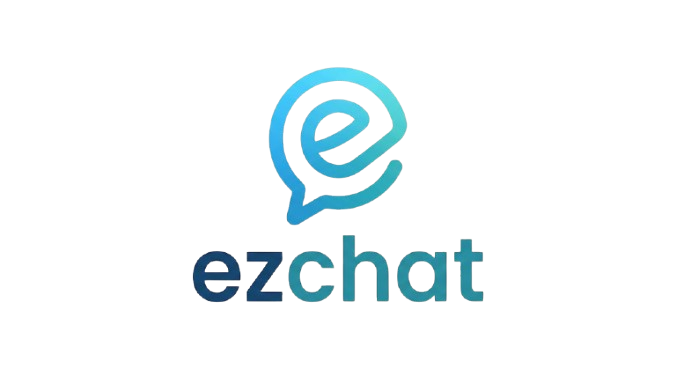

# 

Modern real-time chat application with group messaging, profile management, and end-to-end encryption simulation.

## ✨ Features

- **Real-time Messaging**: Instant message delivery using Socket.io with typing indicators.
- **Voice & Video Calls**: Peer-to-peer WebRTC based calling with the ability to dynamically toggle camera mid-call.
- **Rich Media Sharing**: Support for sharing multiple images and documents simultaneously, powered by Cloudinary.
- **Message Read Receipts**: Granular message status tracking (Pending → Sent → Delivered → Read) with synchronized UI indicators.
- **Message Control**: Users can delete messages for everyone, with real-time removal across all connected clients.
- **Mutual Friendships**: Robust friend request system using unique CV-IDs or usernames.
- **Secure Messaging**: Messages are encrypted via AES-256 (CryptoJS) simulating end-to-end encryption.
- **User Settings & Profile Management**: Customizable profiles, avatars, and bios with a modern settings panel.
- **Premium UI/UX**: Glassmorphic styling, sleek dark mode theme, subtle animations (shadcn/ui & Tailwind CSS), and responsive layouts.

## 🛠️ Technologies

### Frontend
- **Framework**: React 18, Vite, TypeScript
- **Styling**: Tailwind CSS, shadcn/ui, Framer Motion
- **State/Routing**: React Router DOM, React Query (TanStack)
- **Media**: Embla Carousel, Emoji Picker React

### Backend
- **Runtime**: Node.js, Express.js
- **Database**: MongoDB, Mongoose
- **Real-time**: Socket.io (WebSockets), WebRTC
- **File Storage**: Cloudinary, Multer
- **Security**: JWT (Authentication), bcryptjs, crypto-js (Encryption)

## 🚀 Getting Started

Follow these steps to get a local copy up and running.

### 📋 Prerequisites

- **Node.js**: [Download and install Node.js](https://nodejs.org/) (Version 18 or higher recommended)
- **MongoDB**: You need a running MongoDB instance. You can use [MongoDB Atlas](https://www.mongodb.com/cloud/atlas) (Cloud) or [MongoDB Community Server](https://www.mongodb.com/try/download/community) (Local).

### 🛠️ Installation & Setup

#### 1. Clone the repository
```bash
git clone https://github.com/your-username/ezchat.git
cd ezchat
```

#### 2. Backend Setup
1. Navigate to the server directory:
   ```bash
   cd server
   ```
2. Install dependencies:
   ```bash
   npm install
   ```
3. Create a `.env` file in the `server` folder and add your credentials:
   ```env
   MONGODB_URI=your_mongodb_connection_string
   JWT_SECRET=your_secret_key_here
   ENCRYPTION_KEY=your_32_character_encryption_key
   PORT=5001
   ```

#### 3. Frontend Setup
1. Navigate to the client directory:
   ```bash
   cd ../client
   ```
2. Install dependencies:
   ```bash
   npm install
   ```
3. (Optional) Create a `.env` file in the `client` folder if you want to use a different backend URL:
   ```env
   VITE_API_URL=http://localhost:5001
   ```

### 💻 Running the Project

You need to run both the server and the client simultaneously.

**Terminal 1: Server**
```bash
cd server
npm run dev
```

**Terminal 2: Client**
```bash
cd client
npm run dev
```

Once both are running, open your browser and go to:
**[http://localhost:5173](http://localhost:5173)** (or the port shown in your terminal).

---

## 🛡️ Security Note
This project uses **AES-256-CBC** encryption for messages. The `ENCRYPTION_KEY` must be consistent across the server and client (if client-side decryption is used) or managed securely via the backend. **Never share your `.env` file!**

## 🗺️ Roadmap
- [x] Real-time messaging & status
- [x] Media & Document sharing with progress tracking
- [x] Peer-to-peer Voice/Video calls
- [x] Message reactions & Forwarding
- [x] **WiFi Mode & Direct P2P File Transfer**
- [ ] Group Chat functionality
- [ ] End-to-end encryption with Signal Protocol
